# Solar System Viewer - Architecture Documentation

## 🏗️ Project Architecture Overview

This document outlines the complete architecture of the Solar System Viewer, a production-quality 3D solar system simulation built with Next.js and React Three Fiber.

## 📋 Table of Contents

- [Overall System Architecture](#overall-system-architecture)
- [Technology Stack](#technology-stack)
- [Project Structure](#project-structure)  
- [Component Hierarchy](#component-hierarchy)
- [Data Flow Architecture](#data-flow-architecture)
- [3D Rendering Pipeline](#3d-rendering-pipeline)
- [Mission Control Interface](#mission-control-interface)
- [User Interaction Flow](#user-interaction-flow)
- [State Management](#state-management)
- [Deployment Pipeline](#deployment-pipeline)

## 🌟 Overall System Architecture


## 🚀 Technology Stack

### External Dependencies

| Technology | Purpose | Version |
|------------|---------|---------|
| **Next.js** | React framework with App Router | 14.2.32 |
| **React Three Fiber** | React renderer for Three.js | 8.18.0 |
| **Three.js** | 3D graphics library (WebGL) | 0.159.0 |
| **@react-three/drei** | 3D utilities and helpers | 9.122.0 |
| **@react-three/postprocessing** | Visual effects pipeline | 2.19.1 |
| **Tailwind CSS** | Utility-first CSS framework | 3.4.17 |
| **TypeScript** | Type safety and development | 5.9.2 |

## 📁 Project Structure

```mermaid
graph TD
    subgraph "Root Directory"
        App["📁 app/"]
        Components["📁 components/"]
        Lib["📁 lib/"]
        Public["📁 public/"]
        Config["⚙️ Config Files"]
    end

    subgraph "App Router"
        Layout["layout.tsx<br/>Root Layout"]
        Page["page.tsx<br/>Home Page"]
        Globals["globals.css<br/>Global Styles"]
    end

    subgraph "Components"
        SolarMain["SolarSystemEnhanced.tsx<br/>(3000+ lines)"]
        EasterSun["SunEasterEgg.tsx"]
        EasterMilky["MilkyWayEasterEgg.tsx"]
        Objects["📁 objects/"]
    end

    subgraph "3D Objects"
        Sun3D["Sun.tsx"]
        Planet3D["Planet.tsx"] 
        Moon3D["Moon.tsx"]
        Rings3D["SaturnRings.tsx"]
        Asteroids3D["AsteroidBelt.tsx"]
        Stars3D["BackdropStars.tsx"]
        Galaxy3D["Galaxy.tsx"]
    end

    subgraph "Data & Assets"
        PlanetData["planets.ts<br/>Astronomical Data"]
        Textures["🖼️ textures/planets/"]
        Videos["🎬 celestial_bodies/"]
        SVGs["🎭 movie_shapes/"]
        MovieData["movieReferences.json"]
    end

    subgraph "Configuration"
        NextConfig["next.config.js"]
        TailwindConfig["tailwind.config.ts"]
        TSConfig["tsconfig.json"]
        PackageJSON["package.json"]
    end

    App --> Layout
    App --> Page
    App --> Globals
    Components --> SolarMain
    Components --> EasterSun
    Components --> Objects
    Objects --> Sun3D
    Objects --> Planet3D
    Objects --> Moon3D
    Lib --> PlanetData
    Public --> Textures
    Public --> Videos
```



```
├── app/                    # Next.js App Router
│   ├── globals.css        # Global styles with Tailwind
│   ├── layout.tsx         # Root layout component
│   └── page.tsx           # Home page with dynamic import
├── components/
│   ├── SolarSystemEnhanced.tsx    # Main application (3000+ lines)
│   ├── SunEasterEgg.tsx          # Interactive movie references
│   ├── MilkyWayEasterEgg.tsx     # Galaxy-triggered animations
│   └── objects/                  # 3D component library
│       ├── Sun.tsx              # Central star with glow effects
│       ├── Planet.tsx           # Generic planet component
│       ├── Moon.tsx             # Satellite bodies
│       ├── SaturnRings.tsx      # Ring system (DoubleSide)
│       ├── AsteroidBelt.tsx     # 5000 instanced objects
│       ├── BackdropStars.tsx    # Starfield with 5000+ stars
│       └── Galaxy.tsx           # Milky Way background
├── lib/
│   └── planets.ts         # Astronomical data and constants
├── public/
│   ├── textures/planets/  # Planet texture images (JPG)
│   ├── celestial_bodies/  # Video assets (MP4)
│   ├── movie_shapes/      # Easter egg SVGs
│   └── movieReferences.json    # Easter egg data
```

## 🧩 Component Hierarchy


## 🧩 Core Components

### SolarSystemEnhanced.tsx
**Main orchestrator containing all functionality**

- **Size**: 3000+ lines of code
- **Role**: Central hub managing all 3D objects, UI controls, and interactions
- **Features**:
  - Professional Mission Control interface
  - Camera system with automatic/manual modes
  - Easter egg trigger system
  - Real-time state management
  - Event handling and mouse interactions

### Easter Egg System

#### SunEasterEgg.tsx
- **Trigger**: Zoom into the Sun 
- **Features**:
  - Random movie/spacecraft SVG animations
  - Sine curve floating paths (240px amplitude)
  - Random clockwise/counterclockwise rotation
  - Random phase offset for unpredictable motion
  - Movie quotes and references
  - Elegant fade-in/fade-out sequences

#### MilkyWayEasterEgg.tsx
- **Trigger**: Galaxy interactions
- **Purpose**: Additional interactive content

## 🌌 3D Objects System

### Celestial Bodies

| Component | Purpose | Technical Details |
|-----------|---------|-------------------|
| **Sun** | Central star | Emissive material + bloom effects |
| **Planet** | Generic planets | Standard material with optional textures |
| **Moon** | Satellite bodies | Orbital mechanics with realistic speeds |
| **SaturnRings** | Ring system | DoubleSide rendering for all-angle visibility |

### Special Implementations

#### Procedural Jupiter
- **Method**: Canvas-based texture generation
- **Features**: 14 atmospheric bands with custom colors and thickness
- **Great Red Spot**: Elliptical storm in southern hemisphere
- **Performance**: Client-side only, cached texture

#### Enhanced Saturn System
- **7 Major Moons**: Titan, Rhea, Enceladus, Iapetus, Dione, Tethys, Mimas
- **Realistic Orbital Mechanics**: Irrational speed ratios prevent bunching
- **Ring Visibility**: DoubleSide material for viewing from any angle

### Performance Optimizations

#### Instanced Rendering
- **Asteroid Belt**: 5,000+ objects using InstancedMesh
- **Kuiper Belt**: Additional outer solar system objects
- **Starfield**: 5,000+ background stars
- **Benefit**: Minimal draw calls for massive object counts

## 🌊 Data Flow Architecture


## 📊 Data Layer

### planets.ts - Central Astronomical Database


**Core Interface:**
```typescript
export interface PlanetData {
  name: string
  color: string
  radiusKm: number
  distanceAu: number
  periodDays: number
  hasRings: boolean
  texture: string
  tiltDeg?: number
}
```

**Data Sources:**
- Real astronomical values from NASA/JPL
- Scaled appropriately for 3D visualization
- Moon orbital data included

## 🎨 3D Rendering Pipeline


## 🎛️ Mission Control Interface

```mermaid
graph TD
    subgraph "Mission Control Panel"
        Header["Mission Control Header<br/>+ Pin/Info/Reset Controls"]
        ControlPanels["Control Panel Grid<br/>(2×2 + 2 full-width)"]
    end

    subgraph "Scientific Control Panels"
        VelocityPanel["VELOCITY CONTROL<br/>• 0-100% range<br/>• 16 minor ticks<br/>• Decimal labels"]
        ElevationPanel["ELEVATION CONTROL<br/>• -90° to 90° range<br/>• Dual range sliders<br/>• 16 minor ticks"]
        OrbitPanel["ORBIT ACCELERATION<br/>• 0-5000× range<br/>• 45 minor ticks<br/>• K notation"]
        GalaxyPanel["GALAXY LUMINOSITY<br/>• 0-100% range<br/>• 36 minor ticks<br/>• Percentage labels"]
    end

    subgraph "Display Configuration"
        ToggleGrid["6 Toggle Switches<br/>(3×2 grid)"]
        SunToggle["SUN Toggle"]
        OrbitToggle["ORBITS Toggle"]
        PlanetToggle["PLANETS Toggle"]
        MoonToggle["MOONS Toggle"]
        AsteroidToggle["ASTEROIDS Toggle"]
        StarToggle["STAR FIELD Toggle"]
        StatusBadge["Dynamic Status<br/>(X ACTIVE)"]
    end

    subgraph "Professional Styling"
        ScientificTicks["Scientific Tick Marks<br/>• Major: 6px × 1px<br/>• Minor: 3px × 0.5px"]
        CyanGlow["Cyan Glow Effects<br/>• Toggle illumination<br/>• Slider handles"]
        Typography["NASA Typography<br/>• Orbitron font<br/>• Precise spacing"]
        StatusColors["Dynamic Colors<br/>• Green: Active<br/>• Orange: Nominal/Off"]
    end

    Header --> ControlPanels
    ControlPanels --> VelocityPanel
    ControlPanels --> ElevationPanel
    ControlPanels --> OrbitPanel
    ControlPanels --> GalaxyPanel
    ControlPanels --> ToggleGrid
    ToggleGrid --> SunToggle
    ToggleGrid --> OrbitToggle
    ToggleGrid --> PlanetToggle
    ToggleGrid --> StatusBadge
    VelocityPanel --> ScientificTicks
    ToggleGrid --> CyanGlow
```



### Professional NASA-Style Controls

#### Slider Components
All sliders feature scientific precision with major/minor tick marks:

| Control | Range | Features |
|---------|-------|----------|
| **VELOCITY CONTROL** | 0-100% | 16 minor ticks, decimal labels (0, .25, .5, .75, 1) |
| **ELEVATION CONTROL** | -90° to 90° | 16 minor ticks, dual-range slider |
| **ORBIT ACCELERATION** | 0-5000x | 45 minor ticks, K-notation (0, 1K, 2K...) |
| **GALAXY LUMINOSITY** | 0-100% | 36 minor ticks, percentage labels |

#### Display Configuration
- **6 Dynamic Toggles**: SUN, ORBITS, PLANETS, MOONS, ASTEROIDS, STAR FIELD
- **Smart Status Indicator**: Green when active, orange when none active
- **Cyan Glow Effects**: Professional toggle switches with uniform spacing
- **Real-time Counting**: Dynamic counter reflects actual active features

#### Technical Implementation
- **Precise Positioning**: Absolute positioning with mathematical alignment
- **Consistent Styling**: 1px borders, reduced font weights, scientific tick marks
- **Responsive Design**: Works on desktop, tablet, and mobile
- **Event Handling**: Prevents camera mode conflicts with stopPropagation()

## ✨ Special Features

### Advanced UI Elements

#### Scientific Tick Marks
- **Major Ticks**: 6px height, 1px width, 50% opacity
- **Minor Ticks**: 3px height, 0.5px width, 25% opacity
- **Perfect Alignment**: Edge-aligned with mathematical precision
- **Text Positioning**: Smart left/right/center alignment based on position

#### Toggle Switches
- **Uniform Spacing**: 6.5px from all edges (2px more than original)
- **Circle Size**: 15px diameter (25% smaller than original)
- **Glow Effects**: Cyan illumination when active, dark when inactive
- **Animation**: 300ms transitions with easing

### Procedural Generation

#### Jupiter Atmospheric Bands
```typescript
const bands = [
  { color: '#BFAB87', thickness: 4 },  // Wide equatorial band
  { color: '#BB9D7B', thickness: 1 },  // Thin belt
  // ... 12 more bands with realistic colors and proportions
]
```
- **Canvas-based**: Safe, no shader complexity
- **Great Red Spot**: Positioned at 30% longitude, 65% latitude
- **Color Variety**: Authentic atmospheric tones

## 🎮 User Interaction Flow


## 🔄 State Management Architecture

```mermaid
graph TB
    subgraph "React State Layer"
        TimeScaleState["timeScale<br/>(100× default)"]
        CameraStates["Camera States<br/>• cameraAnimation<br/>• cameraSpeed<br/>• cameraVerticalMin/Max"]
        VisibilityStates["Visibility States<br/>• showSun<br/>• showOrbits<br/>• showPlanets<br/>• showMoons<br/>• showAsteroidBelt<br/>• showStars"]
        BrightnessState["milkyWayBrightness<br/>(Galaxy luminosity)"]
        EasterEggStates["Easter Egg States<br/>• easterEggActive<br/>• cooldown timers<br/>• current silhouette"]
    end

    subgraph "Computed Values"
        PlanetPositions["Planet Positions<br/>(Real-time orbital calc)"]
        MoonPositions["Moon Positions<br/>(Satellite mechanics)"]
        CameraPosition["Camera Position<br/>(Auto/manual blend)"]
        UIStates["UI States<br/>• Active count<br/>• Status colors<br/>• Hover states"]
    end

    subgraph "3D Scene State"
        ThreeJSObjects["Three.js Object3D<br/>• Meshes<br/>• Groups<br/>• Materials"]
        AnimationFrames["useFrame Callbacks<br/>• Orbital motion<br/>• Camera movement<br/>• Rotation updates"]
        RenderState["Render State<br/>• Visible objects<br/>• Material properties<br/>• Lighting"]
    end

    TimeScaleState --> PlanetPositions
    CameraStates --> CameraPosition
    VisibilityStates --> UIStates
    VisibilityStates --> RenderState
    PlanetPositions --> ThreeJSObjects
    CameraPosition --> AnimationFrames
    UIStates --> AnimationFrames
    AnimationFrames --> RenderState
```



### Camera System

#### Automatic Mode
- **Orbital Motion**: Smooth camera rotation around solar system
- **Configurable Speed**: 0-100% via VELOCITY CONTROL
- **Elevation Limits**: Customizable vertical boundaries
- **Sine Wave Pattern**: Natural movement avoiding mechanical feel

#### Manual Mode  
- **OrbitControls**: Mouse/keyboard navigation
- **Zoom Limits**: Prevented extreme close/far positions
- **Mode Switching**: Space bar or control key activation
- **Easter Egg Integration**: Proximity-based triggers

## 🔄 Orbital Mechanics System


### Planetary Motion
```typescript
// Realistic orbital calculation
const angle = startAngle + (state.clock.elapsedTime * speed)
const currentDistance = distance * (1 - eccentricity * Math.cos(angle))

groupRef.current.rotation.y = angle
planetGroupRef.current.position.x = currentDistance
planetGroupRef.current.position.y = Math.sin(angle) * inclination * 0.5
```

### Alignment Optimization
- **Reduced Eccentricity**: Mars, Jupiter, Saturn, Uranus set to 0.01
- **DoubleSide Orbit Rings**: Visible from all camera angles
- **Visual Harmony**: Planets follow rings closely without complex geometry

### Moon Systems


#### Realistic Orbital Mechanics
- **Irrational Speed Ratios**: Prevent periodic bunching/alignment
- **Varied Starting Positions**: Natural distribution around parent planets
- **Size Variation**: Authentic relative scales

## 🎮 Interaction System

### Mouse/Touch Controls
- **Left Click + Drag**: Rotate camera around solar system
- **Right Click + Drag**: Pan camera position  
- **Mouse Wheel**: Zoom in/out with limits
- **Touch Support**: Full mobile gesture controls

### Keyboard Controls
- **Space**: Toggle Automatic/Manual camera modes
- **Arrow Keys**: Manual camera movement (switches to manual mode)
- **Z/X**: Zoom in/out controls
- **Escape**: Reset to defaults

### Easter Egg Triggers
- **Sun Proximity**: Distance-based activation when zooming into sun
- **Galaxy Interaction**: Milky Way-based triggers
- **Cooldown System**: Prevents spam activation
- **State Management**: Elegant activation/deactivation cycles

## 🚀 Deployment Pipeline

```mermaid
flowchart LR
    subgraph "Development"
        LocalDev["Local Development<br/>npm run dev<br/>localhost:3000"]
        Changes["Code Changes<br/>SolarSystemEnhanced.tsx<br/>UI Improvements"]
        Testing["Testing & Debugging<br/>Browser DevTools<br/>Console Logs"]
    end

    subgraph "Version Control"
        GitAdd["git add .<br/>Stage Changes"]
        GitCommit["git commit -m<br/>Descriptive Message"]
        GitPush["git push origin main<br/>GitHub Repository"]
    end

    subgraph "Build & Deploy"
        VercelDetect["Vercel Webhook<br/>Detects Push"]
        NextBuild["next build<br/>Optimization<br/>Bundle Analysis"]
        StaticGen["Static Generation<br/>SSG + Client Rendering"]
        EdgeDeploy["Edge Deployment<br/>Global CDN"]
    end

    subgraph "Production"
        ProdURL["Production URL<br/>https://ssss-3oqwjn86q-...vercel.app"]
        Performance["Performance<br/>• ~325kB bundle<br/>• 60fps WebGL<br/>• Mobile optimized"]
        Monitoring["Real-time Monitoring<br/>Vercel Analytics"]
    end

    LocalDev --> Changes
    Changes --> Testing
    Testing --> GitAdd
    GitAdd --> GitCommit
    GitCommit --> GitPush
    GitPush --> VercelDetect
    VercelDetect --> NextBuild
    NextBuild --> StaticGen
    StaticGen --> EdgeDeploy
    EdgeDeploy --> ProdURL
    ProdURL --> Performance
    Performance --> Monitoring
```




### Development Workflow
1. **Local Development**: `npm run dev` on localhost:3000
2. **Build Process**: `npm run build` creates optimized production build
3. **Git Integration**: Changes committed to GitHub repository
4. **Auto-Deployment**: Vercel detects pushes and deploys automatically

### Production Environment
- **Repository**: https://github.com/pierreabs007/space-out
- **Production URL**: https://ssss-3oqwjn86q-pierre-abs-projects.vercel.app
- **Build Optimization**: Next.js SSG/SSR with WebGL client-side rendering
- **Asset Optimization**: Automatic image/video optimization by Vercel

### Performance Characteristics
- **Bundle Size**: ~325kB total JavaScript
- **WebGL Rendering**: Hardware-accelerated 3D graphics
- **Responsive Design**: Optimized for desktop/mobile
- **Loading Strategy**: Dynamic imports prevent SSR issues

## 🎭 Easter Egg System Architecture


## 🔧 Technical Decisions

### Client-Side Rendering
- **3D Scene**: Dynamic import with `ssr: false`
- **Reason**: WebGL compatibility and browser-specific optimizations
- **Benefit**: Prevents server-side rendering conflicts

### State Management
- **React Hooks**: useState for all interactive controls
- **Local State**: No external state management needed
- **Event Handling**: Direct prop passing and callback functions

### Performance Strategy

```mermaid
graph TD
    subgraph "Rendering Optimizations"
        InstancedMesh["InstancedMesh<br/>• 5000 asteroids<br/>• 5000 stars<br/>• Single draw call"]
        LOD["Level of Detail<br/>• Reduced geometry<br/>• Distance-based culling"]
        Culling["Frustum Culling<br/>• Off-screen objects<br/>• Automatic optimization"]
    end

    subgraph "Memory Management" 
        TextureCache["Texture Caching<br/>• Canvas textures<br/>• Reused materials"]
        GeometryReuse["Geometry Reuse<br/>• Shared sphere geometry<br/>• Material instances"]
        StateOptimization["State Optimization<br/>• useMemo hooks<br/>• Dependency arrays"]
    end

    subgraph "Animation Performance"
        RAF["requestAnimationFrame<br/>• 60fps target<br/>• Browser-optimized timing"]
        useFrameOptim["useFrame Optimization<br/>• Minimal calculations<br/>• Early returns"]
        ConditionalRender["Conditional Rendering<br/>• Toggle-based visibility<br/>• Performance scaling"]
    end

    subgraph "Bundle Optimization"
        NextJSOptim["Next.js Optimization<br/>• Tree shaking<br/>• Code splitting"]
        DynamicImports["Dynamic Imports<br/>• ssr: false for 3D<br/>• Lazy loading"]
        AssetOptim["Asset Optimization<br/>• Image compression<br/>• Video optimization"]
    end

    InstancedMesh --> RAF
    TextureCache --> GeometryReuse
    RAF --> useFrameOptim
    ConditionalRender --> NextJSOptim
    DynamicImports --> AssetOptim
```



- **Instanced Rendering**: Massive object counts with minimal performance impact
- **Optimized Geometries**: Reduced vertex counts where appropriate
- **Conditional Rendering**: Features toggle on/off for performance control
- **Animation Optimization**: requestAnimationFrame for smooth 60fps

## 🎨 Design Philosophy

### User Experience
- **Professional Interface**: NASA mission control aesthetic
- **Scientific Accuracy**: Real astronomical data and physics
- **Visual Harmony**: Consistent styling and professional typography
- **Interactive Discovery**: Easter eggs and hidden features reward exploration

### Visual Design
- **Color Palette**: Cyan/blue tech aesthetic with warm planetary tones
- **Typography**: Orbitron/Space Mono for sci-fi feel
- **Spacing**: Mathematical precision with uniform measurements
- **Glow Effects**: Subtle illumination for futuristic appearance

## 📈 Development Evolution Timeline


## 🔧 System Integration Overview

```mermaid
graph TD
    subgraph "Frontend Stack"
        React["React 18<br/>Component Framework"]
        NextJS["Next.js 14<br/>Full-Stack Framework"]
        TypeScript["TypeScript<br/>Type Safety"]
    end

    subgraph "3D Graphics Stack"
        WebGL["WebGL<br/>Hardware Acceleration"]
        ThreeJS["Three.js<br/>3D Engine"]
        R3F["React Three Fiber<br/>React Integration"]
        Drei["@react-three/drei<br/>Utility Components"]
    end

    subgraph "Styling & UI"
        TailwindCSS["Tailwind CSS<br/>Utility Classes"]
        CustomCSS["Custom CSS<br/>Mission Control"]
        LucideReact["Lucide React<br/>Icons"]
    end

    subgraph "Development Tools"
        ESLint["ESLint<br/>Code Quality"]
        PostCSS["PostCSS<br/>CSS Processing"]
        Autoprefixer["Autoprefixer<br/>Browser Compatibility"]
    end

    subgraph "Production"
        VercelPlatform["Vercel<br/>• Edge Functions<br/>• CDN<br/>• Analytics"]
        GitHubRepo["GitHub<br/>• Version Control<br/>• CI/CD Integration"]
    end

    React --> NextJS
    NextJS --> TypeScript
    WebGL --> ThreeJS
    ThreeJS --> R3F
    R3F --> Drei
    TailwindCSS --> CustomCSS
    ESLint --> PostCSS
    NextJS --> VercelPlatform
    GitHubRepo --> VercelPlatform
```



---

## 📈 Future Enhancement Possibilities

### Potential Additions
- **More Planetary Textures**: Procedural generation for other planets
- **Enhanced Physics**: More complex orbital mechanics
- **Additional Easter Eggs**: Expanded movie reference system
- **Sound Design**: Ambient space audio
- **VR Support**: Three.js VR integration
- **Educational Content**: Detailed astronomical information panels

### Performance Optimizations
- **LOD System**: Level-of-detail for distant objects
- **Culling**: Frustum culling for off-screen objects  
- **Texture Streaming**: Progressive texture loading
- **WebXR Integration**: Immersive VR/AR experiences

---

*Last Updated: January 2025*  
*Version: Production v1.0*  
*Repository: https://github.com/pierreabs007/space-out*
